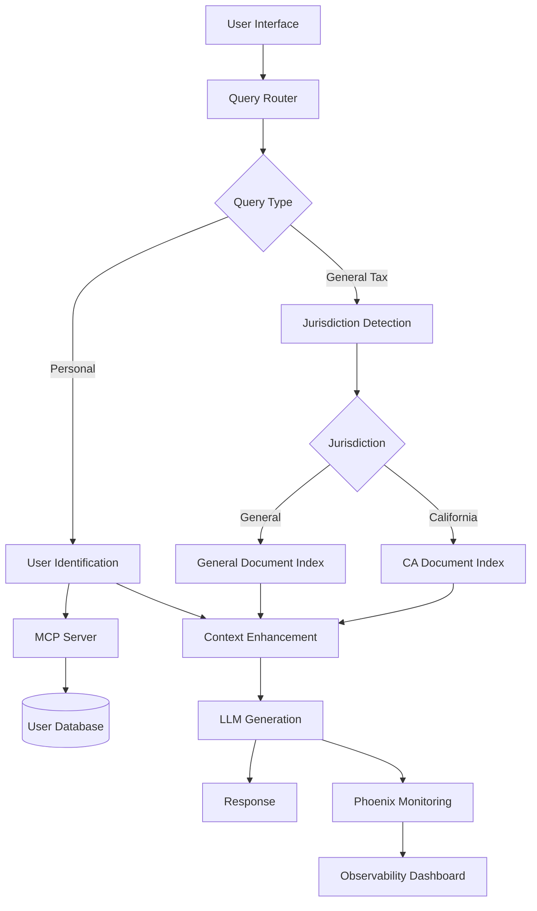

# Tax Chatbot Architecture

## System Overview

The Tax Chatbot is a sophisticated AI-powered system that combines advanced retrieval techniques, intelligent query routing, and context-enhanced generation to provide accurate tax assistance. The system is designed to handle both general tax queries and personal tax information requests with jurisdiction-specific awareness.

## High-Level Architecture



## Core Components

### 1. Query Router (`src/core/query_router.py`)

**Purpose**: Intelligent classification of incoming queries to determine processing path.

**Implementation**:
- **LangChain MultiRouteChain**: Uses GPT-Neo-2.7B for classification
- **Query Types**: 
  - `general_tax`: Standard tax information queries
  - `user_data`: Personal tax information requests
- **Confidence Scoring**: Threshold-based routing (default: 0.6)
- **Fallback Strategy**: Routes to general tax if confidence is low

**Key Features**:
```python
# Classification flow
query → LangChain Router → {"route": "general_tax", "confidence": 0.85}
```

### 2. Jurisdiction Detection (`src/utils/jurisdiction_detector.py`)

**Purpose**: Automatically detect California-specific vs general tax queries.

**Implementation**:
- **Keyword Library**: 50+ California-specific terms
- **Pattern Matching**: Regex patterns for CA tax terminology
- **Confidence Scoring**: Weighted keyword scoring system
- **Fallback**: Defaults to general jurisdiction if uncertain

**Example Keywords**:
- California, CA, FTB, pub29, California tax, property tax rates
- Franchise Tax Board, California residents, CA state tax

### 3. Hierarchical Retrieval (`src/core/llama_retrieval.py`)

**Purpose**: Advanced document retrieval using LlamaIndex with jurisdiction filtering.

**Architecture**:
```python
# Retrieval Strategy
if jurisdiction == "california":
    filters = MetadataFilters([ExactMatchFilter(key="jurisdiction", value="california")])
    ca_results = index.as_query_engine(filters=filters).query(query)
    if ca_results.response.strip():
        return ca_results

# Fallback to general documents
return index.as_query_engine().query(query)
```

**Components**:
- **LlamaIndex VectorStoreIndex**: Wrapper over ChromaDB
- **Metadata Filtering**: Jurisdiction-specific document filtering
- **Smart Fallback**: CA-specific → general document strategy
- **Cache Management**: Efficient query result caching

### 4. Vector Store (`src/core/vector_store.py`)

**Purpose**: High-performance vector storage and similarity search.

**Implementation**:
- **ChromaDB**: Persistent vector database
- **BGE Embeddings**: BAAI/bge-base-en-v1.5 for text encoding
- **Metadata Management**: Complex metadata filtering for ChromaDB compatibility
- **Collection Stats**: Real-time database statistics

**Document Structure**:
```json
{
  "id": "doc_123",
  "document": "Tax content...",
  "metadata": {
    "jurisdiction": "california",
    "source": "pub29.pdf",
    "document_type": "tax_publication",
    "section": "property_tax"
  }
}
```

### 5. MCP Server Integration (`src/core/tax_mcp_client.py`)

**Purpose**: Standards-compliant Model Context Protocol implementation for database operations.

**Architecture**:
```
Client → JSON-RPC → MCP Server → SQLite Database
```

**Features**:
- **Pure MCP Protocol**: No fallback mechanisms, true standards compliance
- **Process Isolation**: Database operations in separate process
- **User Lookup Methods**:
  - Name-based lookup with fuzzy matching
  - Email-based exact matching
  - Tax ID validation and lookup
- **Caching**: LRU cache for performance optimization

### 6. Language Model Service (`src/core/llm_service.py`)

**Purpose**: Central LLM orchestration with context enhancement.

**Model Configuration**:
- **Base Model**: EleutherAI/gpt-neo-2.7B
- **Precision**: float16 for memory efficiency
- **Memory Management**: Automatic cache clearing every 10 queries
- **Temperature**: 0.1 for consistent, factual responses

**Context Enhancement**:
```python
enhanced_context = {
    'user_name': 'Sarah Johnson',
    'filing_status': 'single',
    'annual_income': 75000.00,
    'tax_bracket': '22%',
    'state': 'TX',
    'retrieved_documents': [...]
}
```

### 7. User Interfaces

#### CLI Interface (`src/interfaces/cli_chat.py`)
- **Rich Terminal UI**: Colored output and interactive commands
- **Command System**: Built-in commands for system management
- **History Management**: Conversation history with search
- **Memory Monitoring**: Real-time GPU/system memory display

#### Web Interface (`src/interfaces/web_interface.py`)
- **Streamlit Application**: Modern web UI
- **Real-time Updates**: Live system statistics
- **Interactive Sidebar**: System controls and user management
- **Identical Logic**: Uses same routing as CLI interface

## Data Flow

### General Tax Query Flow
```
1. User Query: "What is B&O tax?"
2. Query Router → Classification: "general_tax" (confidence: 0.85)
3. Jurisdiction Detection → "general" (no CA keywords)
4. Vector Retrieval → General documents from BusinessTaxBasics_0.pdf
5. LLM Generation → Response with tax information
6. Phoenix Monitoring → Log metrics and performance
```

### Personal Tax Query Flow
```
1. User Query: "What are Sarah Johnson's tax obligations?"
2. Query Router → Classification: "user_data" (confidence: 0.92)
3. User Identification → Extract name: "Sarah Johnson"
4. MCP Server → Database lookup → User found
5. Context Enhancement → Add user tax information
6. Vector Retrieval → Relevant tax documents
7. LLM Generation → Personalized response with user context
8. Phoenix Monitoring → Log interaction and performance
```

### California-Specific Query Flow
```
1. User Query: "What are California property tax rates?"
2. Query Router → Classification: "general_tax" (confidence: 0.88)
3. Jurisdiction Detection → "california" (keywords: California, property tax)
4. Vector Retrieval → California documents from pub29.pdf
5. LLM Generation → CA-specific tax information
6. Phoenix Monitoring → Log jurisdiction-specific metrics
```

## Memory Management

### GPU Memory Allocation
- **BGE Embeddings**: ~1.5GB VRAM
- **GPT-Neo-2.7B**: ~6-7GB VRAM (float16)
- **Processing Buffer**: ~3-4GB for batch operations
- **Total Usage**: ~8.5GB (within RTX 2080 Ti 11GB limit)

### Optimization Strategies
- **Batch Size Adjustment**: Dynamic batching based on available memory
- **Cache Clearing**: Automatic GPU cache management
- **Model Loading**: On-demand model loading and unloading
- **Memory Monitoring**: Real-time memory usage tracking

## Monitoring and Observability

### Phoenix-Arize AI Integration (`src/core/phoenix_tracer.py`)
- **Real-time Tracing**: All LLM calls and retrieval operations
- **Custom Metrics**: Tax-specific performance indicators
- **Hallucination Detection**: Automated response quality checking
- **Performance Analytics**: Response time and accuracy tracking

### Evaluation Framework (`src/evaluation/`)
- **Automated Testing**: Scheduled evaluation runs
- **Accuracy Metrics**: Response correctness scoring
- **Jurisdiction Testing**: CA vs general query accuracy
- **Regression Detection**: Performance degradation alerts

## Security and Privacy

### Data Protection
- **Fictional Users**: All demo data is synthetic
- **No Real PII**: No actual personal information stored
- **Local Processing**: All computations happen locally
- **Secure Communication**: MCP protocol with proper error handling

### Access Control
- **Process Isolation**: Database operations isolated via MCP
- **No Direct DB Access**: All database operations through MCP protocol
- **Error Sanitization**: No sensitive information in error messages

## Scalability Considerations

### Current Limitations
- **Single GPU**: Designed for single RTX 2080 Ti
- **Local Deployment**: Not distributed system
- **Memory Bound**: Limited by 11GB VRAM constraint

### Scaling Strategies
- **Model Optimization**: Quantization and pruning for larger deployments
- **Distributed Retrieval**: Multiple vector store instances
- **Load Balancing**: Multiple inference instances
- **Cloud Deployment**: GPU cluster deployment patterns

## Configuration Management

### YAML Configuration (`config.yaml`)
- **Hierarchical Structure**: Organized by component
- **Environment Variables**: Override support for deployments
- **Validation**: Schema validation for all settings
- **Hot Reloading**: Runtime configuration updates

### Key Configuration Sections
```yaml
models:
  llm:
    model_name: "EleutherAI/gpt-neo-2.7B"
    precision: "float16"
    max_memory_gb: 7

vector_store:
  collection_name: "tax_documents"
  persist_directory: "./data/vector_db"

router:
  classification:
    confidence_threshold: 0.6
```

## Testing Strategy

### Component Testing
- **Unit Tests**: Individual component validation
- **Integration Tests**: Cross-component interaction testing
- **Performance Tests**: Memory and speed benchmarking
- **Accuracy Tests**: Response quality validation

### Test Categories
1. **Router Accuracy**: Query classification precision
2. **Retrieval Quality**: Document relevance scoring
3. **Jurisdiction Detection**: CA vs general classification
4. **Memory Management**: GPU memory usage validation
5. **MCP Protocol**: Standards compliance testing

## Future Enhancements

### Planned Features
- **Additional Jurisdictions**: New York, Texas, Florida tax support
- **Advanced Evaluation**: More sophisticated accuracy metrics
- **Real-time Learning**: Continuous model improvement
- **Multi-modal Support**: Document image processing

### Technical Improvements
- **Model Quantization**: Int8 quantization for memory efficiency
- **Caching Layer**: Redis caching for frequent queries
- **API Gateway**: REST API for external integrations
- **Containerization**: Docker deployment support

---

This architecture enables a production-ready tax assistance system with sophisticated AI capabilities, robust monitoring, and efficient resource utilization.