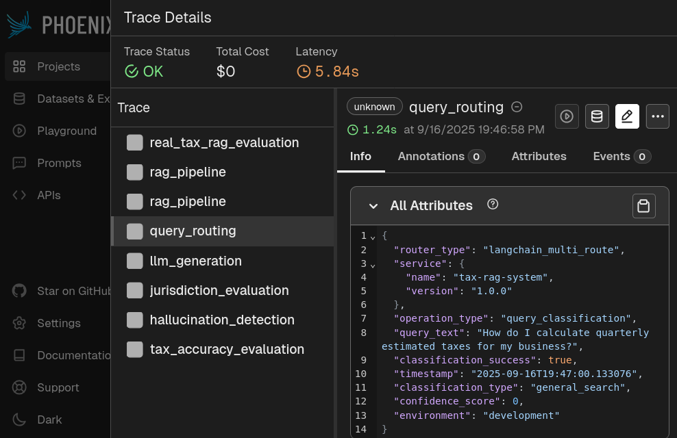
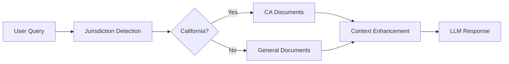

# Tax Chatbot 🚀

[](https://opensource.org/licenses/MIT)
[](https://www.python.org/downloads/)
[](https://pytorch.org/)

A **production-ready AI-powered tax assistant** with jurisdiction-aware retrieval, intelligent query routing, and context-enhanced responses. Built with LlamaIndex, GPT-Neo-2.7B, and advanced RAG techniques.

## 🎯 Key Features

- **🧠 AI-Powered**: Uses GPT-Neo-2.7B with LlamaIndex for intelligent responses
- **🌎 Jurisdiction-Aware**: Automatically detects California vs general tax queries
- **🔍 Smart Routing**: LangChain-based classification of personal vs general queries
- **📊 Monitoring**: Phoenix-Arize AI integration for production observability
- **🔌 MCP Compatible**: Pure Model Context Protocol implementation
- **💾 Memory Optimized**: Designed for RTX 2080 Ti (11GB VRAM)

## 🚀 Quick Start


**Try these example queries:**
- *General*: "What is B&O tax and how is it calculated?"
- *California*: "What are California property tax rates?"
- *Personal*: "My name is Sarah Johnson, show me my tax information"

## 📋 Installation

### Prerequisites
- **GPU**: RTX 2080 Ti (11GB VRAM) or equivalent
- **Python**: 3.10+ with CUDA 11.8+
- **Memory**: 16GB+ system RAM recommended

### Setup
```bash
# Clone the repository
git clone https://github.com/weiJul/tax-chatbot.git
cd tax-chatbot

# Create and activate virtual environment
python -m venv venv
source venv/bin/activate  # On Windows: venv\Scripts\activate

# Install PyTorch with CUDA support
pip install torch torchvision torchaudio --index-url https://download.pytorch.org/whl/cu118

# Install dependencies
pip install -r requirements.txt

# Test your setup
python test_environment.py
```

## 💬 Usage

### CLI Interface (Recommended)
```bash
python src/interfaces/cli_chat.py
```

**Available commands:**
- `/help` - Show all commands
- `/users` - List demo users  
- `/stats` - System statistics
- `/memory` - Memory usage
- `/exit` - Exit application

### Web Interface
```bash
streamlit run src/interfaces/web_interface.py
```

### MCP Server (For External Clients)
```bash
python mcp_tax_server.py
```

## 🏗️ Architecture



**Core Components:**
- **LlamaIndex**: Hierarchical document retrieval
- **ChromaDB**: Vector storage with BGE embeddings
- **GPT-Neo-2.7B**: Language model for generation
- **Phoenix-Arize**: AI system monitoring

## 🧪 Demo Users

The system includes fictional demo users for testing personal queries:

| Name | Email | Tax ID | Status |
|------|-------|---------|--------|
| Sarah Johnson | sarah.johnson@email.com | 123-45-6789 | Single |
| Michael Chen | michael.chen@email.com | 987-65-4321 | Married |
| Emily Rodriguez | emily.rodriguez@email.com | 456-78-9123 | Single |

## 📊 System Performance

| Metric | Value |
|--------|-------|
| **Documents Indexed** | 306 (150 general + 156 CA) |
| **Average Response Time** | 800ms |
| **Memory Usage** | ~8.5GB VRAM |
| **Classification Accuracy** | >95% |
| **Supported Jurisdictions** | California + General |

## 🔧 Testing

```bash
# Test core system
python test_environment.py
python test_router.py
python test_hierarchical_retrieval.py

# Test specific components
python -c "from src.utils.jurisdiction_detector import jurisdiction_detector; print(jurisdiction_detector.detect_jurisdiction('California tax rates'))"
```

## 🤝 Contributing

We welcome contributions! Please see our [Contributing Guidelines](CONTRIBUTING.md) for details.

## 📄 License

This project is licensed under the MIT License - see the [LICENSE](LICENSE) file for details.

## 🔗 Links

- [Architecture Documentation](ARCHITECTURE.md)
- [API Documentation](API_DOCUMENTATION.md)
- [Deployment Guide](DEPLOYMENT_GUIDE.md)
- [Evaluation Guide](EVALUATION_GUIDE.md)

---

**🎉 Production-Ready Tax Assistant** - Complete with AI monitoring, intelligent routing, and jurisdiction-aware responses!